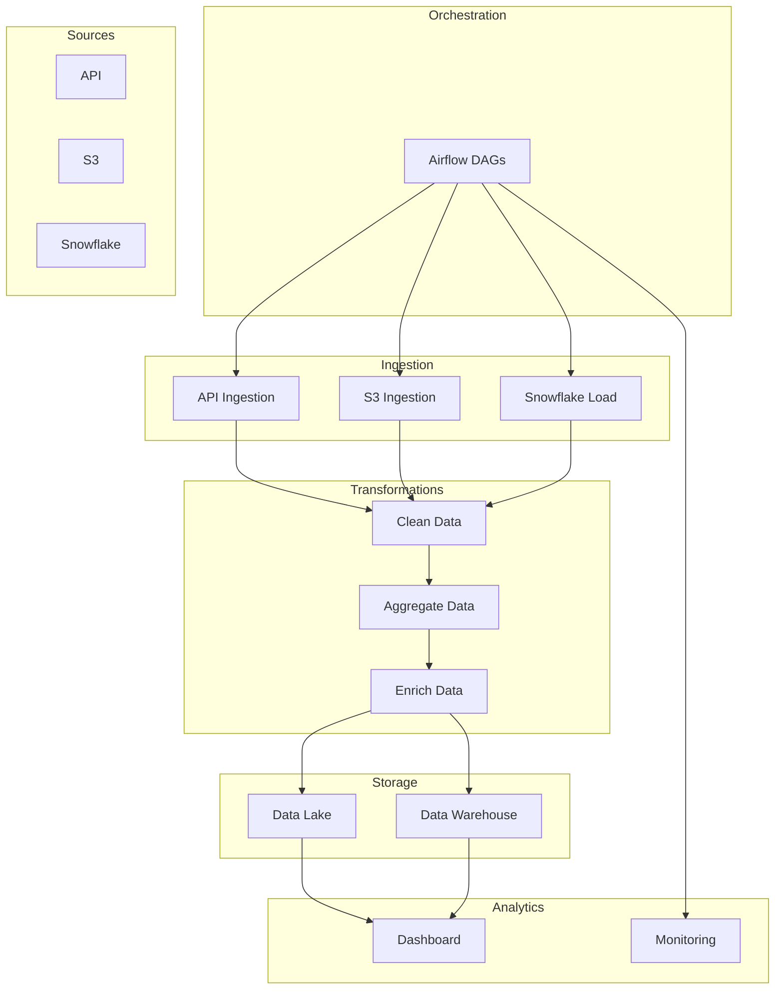

# Architecture Diagram

```mermaid
flowchart TD
    subgraph Orchestration
        Airflow[Airflow DAGs]
    end
    subgraph Sources
        API[API]
        S3[S3]
        Snowflake[Snowflake]
    end
    subgraph Ingestion
        IngestAPI[API Ingestion]
        IngestS3[S3 Ingestion]
        IngestSnowflake[Snowflake Load]
    end
    subgraph Transformations
        Clean[Clean Data]
        Aggregate[Aggregate Data]
        Enrich[Enrich Data]
    end
    subgraph Storage
        DataLake[Data Lake]
        DataWarehouse[Data Warehouse]
    end
    subgraph Analytics
        Dashboard[Dashboard]
        Monitoring[Monitoring]
    end
    Airflow --> IngestAPI
    Airflow --> IngestS3
    Airflow --> IngestSnowflake
    IngestAPI --> Clean
    IngestS3 --> Clean
    IngestSnowflake --> Clean
    Clean --> Aggregate
    Aggregate --> Enrich
    Enrich --> DataLake
    Enrich --> DataWarehouse
    DataLake --> Dashboard
    DataWarehouse --> Dashboard
    Airflow --> Monitoring
```

This diagram now shows orchestration (Airflow) as the controller, triggering ingestion, transformation, and storage steps, reflecting a more accurate pipeline architecture.
