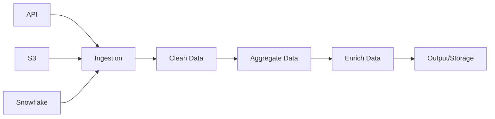

# Data Flow Chart

```mermaid
flowchart LR
    S1[API] --> I[Ingestion]
    S2[S3] --> I
    S3[Snowflake] --> I
    I --> T1[Clean Data]
    T1 --> T2[Aggregate Data]
    T2 --> T3[Enrich Data]
    T3 --> O[Output/Storage]
```

This diagram illustrates the flow of data from various sources through ingestion, transformation, and output/storage in the pipeline.
